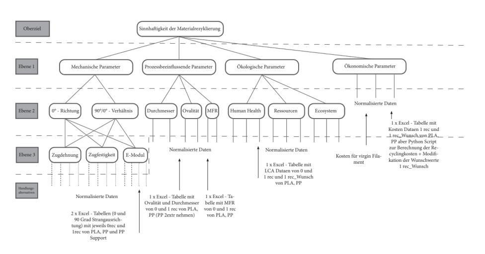
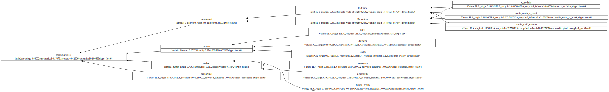
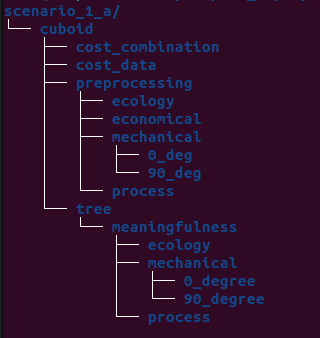
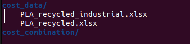
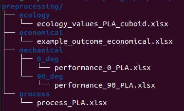
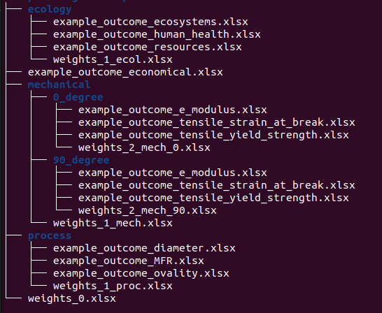

# AHP

Package to apply an AHP. Project files [in the google drive folder](https://drive.google.com/drive/folders/17u5-oOsBx12wAZ7zGiRGsdAQbPqbG3Fh)



## Preview of the AHP process used in this research


# Installation
The programing structure of the code provided in this repository follows the [Good Research Code Practices](https://goodresearch.dev/) - Thanks [@PatrickMineault](https://github.com/patrickmineault/).
The scripts provided as part of this package have inside and outside dependences. Next to local files, residing in [src](./src/), which **have to be [pip installed](#pip-installation)**, outside dependencies are required for running scripts. These can be easily installed via either [conda](#conda) or [pip](#pip).   

## Conda
Install `miniconda` according to the official instructions [here](https://docs.conda.io/projects/miniconda/en/latest/).
Create an environment through the provided [environment.yml](./environment.yml) file by running `conda env create -f environment.yml`
Ensure that pip is installed inside the local package (can be validated through executing `python`, `import pip`, `pip.__file__` and checking it is inside the environment path).

### Activating the environment
Conda environments can be activated with `conda activate <environment_name>`. The default name for the environment as part of the [environment yaml file](./environment.yml) is `ahp`

## Pip
Installing dependences through pip can be done through running `pip install -r requirements.txt`, where [requirements.txt](./requirements.txt) contains a pip list of all necessary dependencies.

## Pip Installation
Install local files residing in [src](./src/) through `pip install -e .`, which will pip install these as editable files. These can then be imported as normal packages, defined in [setup.py](./setup.py), p.ex. executing `python` and `from ahp.utils import *`. 

# Scripts usages
The package provides four main scripts for three processes of the AHP as defined in this usage:
1. The [cost calculation step](#cost-calculation). This is separated into two scripts:
    * [`cost_calculation.py`](./scripts/cost_calculation.py) - for calculating the costs of a single material using a predefined spreadsheet structure 
    * [`cost_combination.py`](./scripts/cost_combination.py) - for combining the costs of multiple materials 
2. The [preprocessing step](#preprocessing) - which prepares the provided files such that these can be used by the AHP process. Implemented in the file [`preprocessing.py`](./scripts/preprocessing.py)
3. The [Tree calculation](#calculating-a-tree), which is the final step and implemented in [`test_ahp.py`](./scripts/test_ahp.py)

An overview of the _directory_ structure of an exemplary scenario looks as follows and can be found in the [data folder](./data/)



## Cost Calculation
The cost calculation can be found in the [scripts](./scripts/cost_calculation.py) directory.
Run from the base directory after [activating the environment](#activating-the-environment) with:
```
    python scripts/cost_calculation.py -i <file> -s <scale> -n <name> -v <value> OPTIONAL -t -o <output_location>
```
Can be run as a command line utility without changes to the code. Will append a linear scaling sheet, without quadratic options, explained [below](#scaling).
Example files can be found in the [cost calculation subfolders](./data/scenario_1_a/cuboid/cost_data/) of each scenario.

An overview of example files is shown below:



Parameters are explained below

### Parameters

* -i, --input: path to an input xls file with the fields filled in. An example file is supplied in: **path to example file here**. Can be multiple, with -i <file1> -i <file2> etc. 
* -s, --scale: Scaling Factor. List. Weight of the recycling mass in gram, to rescale to euros per gramm. Will check for same length as inputs. In order of inputs. E.g. -i <file1> -s <scale1> etc. 
* -n, --name: the name of a material to be used in the output
* -v, --value: the value that material is supposed to be assigned. Name and value are lists and are appended in position with one another. E.g. -n <Material1> -v <Value1> -n <Material2> -v <Value2>
* -t, --time: Boolean flag wether to use time or energy in the calculation of operational costs. Defaults to energy. If set, will use time.
* -o, --output: Output location of the file to be written. Defaults to None. If none, will print dataframe for checking to command line.
* -h, --help: display the help, which will illustrate the parameters 

## Preprocessing
The cost calculation can be found in the [scripts](./scripts/preprocessing.py) directory.
Run from the base directory after activating the environment with:
```
    python scripts/preprocessing.py -i <input> -s <scaling> -o <output>
```
Can be run as a command line utility without changes to the code.
A scaling sheet is appended to the example file which can be found **path to example file**. Scaling options are explained [below](#scaling).
Consistency checks will be performed as part of the script.

An overview of example files is shown below:



Parameters are explained below

### Parameters

* -i, --input: REQUIRED location of the file with the values that have been recorded for each alternative, which will all be leaf nodes. Each line corresponds to a leaf node, measured values, each column to an alternative
* -o, --output: directory where the leaf nodes will be written to. A leaf node has a value for each of the alternatives. If none given, will print to command line. Defaults to none.
* -s, --scaling: optional. Will scale the values to be between {0, 1} according to what _optimal_ values are considered to be.

### Scaling
Scaling values are supplied as a second sheet to the preprocessing excel file. This sheet ensures that recorded measurements for each alternative are scaled between {0,1}
Possibilities exist for linear or quadratic scaling. If values for quadratic are present in the sheet, quadratic scaling will be applied.
* Linear scaling
    * Min: minimum possible value. If None, will use minimum from inputs. E.g. if theoretical minimum for a value is known, supply. 
    * Max: Maximum possible value. if None, will use maximum from inputs. E.g. if theoretical maximum is known, supply. 
    * Inversion: if set to 1, low values represent better options. E.g. Lower costs are usually better. 
* Quadratic scaling
    * Optimal: if an optimal value can be achieved, use this and quadratic distance between optimal and threshold value (or largest distance) will be used. E.g. printing diameter has an optimal centrepoint 
    * Threshold: Set a threshold value after which all parameters will be 0. E.g. in case of diameter, +- 5cm from optimal

## Calculating a tree
Example script is provided [here](./scripts/test_ahp.py) and can be run for example with the following command:
`pyhon scripts/test_ahp.py --i data/scenario_1_a/tree/meaningfulness`
The only parameter is an input directory, from which the tree structure will be set up. The script runs four steps including consistency checks.

1. Reading a tree from a directory structure. This checks for directory and spreadsheet naming conventions 
2. Preparing a tree from the structure provided in the previous steps
3. Checking the integrity of values and weights
4. Calculating the final decision support tree

The final result will be printed to the command line. 
Inside the script are multiple options commented out that can be used for visualisation or outputting recorded files.
Changes can be made in the script after the calculation. Weights and values can be plotted or printed through node convenience methods, see [example](/src/ahp/ahp_functions.py#L409) 

An overview of the example structure of a tree is shown below:



### Parameters

* --input, -i: base directory for a tree setup. The tree should be structured prior to running the calculation. Will provide error checks
